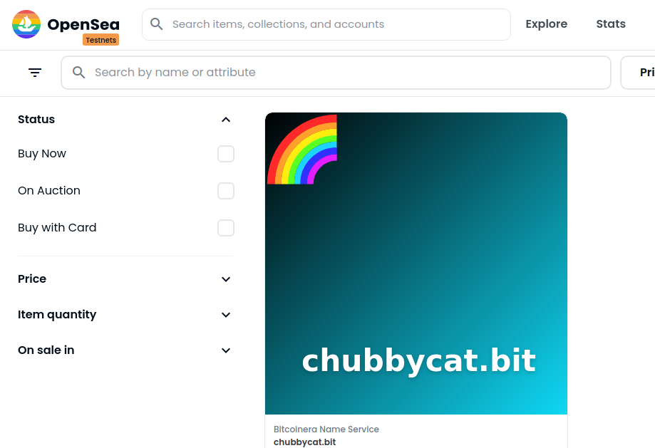

# Polygon ENS Service

Following the project from the \_buildspace community ([link](https://buildspace.so/p/build-polygon-ens/lessons/LE89a52498-8979-4ff0-b05a-2ae9947da32f))

Just deployed to the Mumbai Testnet! 🌈🎉 [Here](https://testnets.opensea.io/collection/bitcoinera-name-service) you can have a glimpse to my domain NFTs on OpenSea.
[Here](https://mumbai.polygonscan.com/address/0xe7Fb251BF2Aa4b5599c4Cb0c4F4E85BF43262553) you can see my contract for the Bitcoinera Name Service on the Mumbai testnet on Polygonscan.

My first domain NFT:

    

